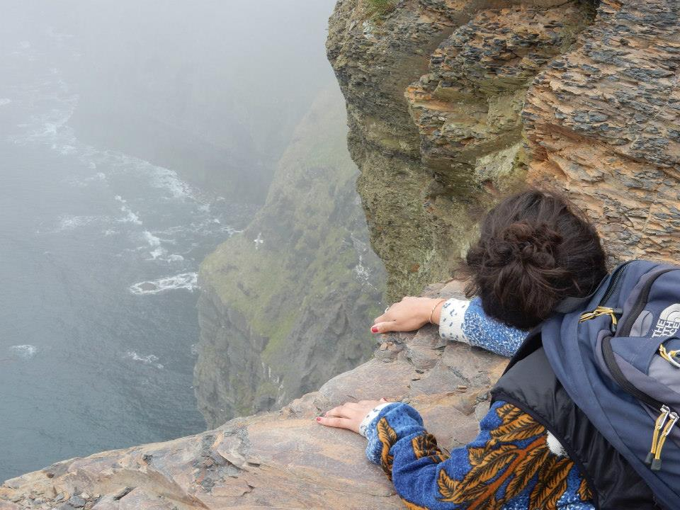
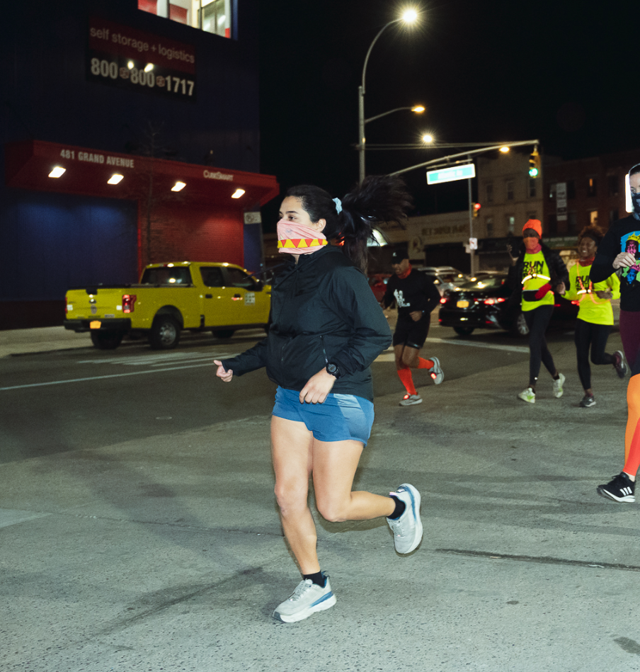

  

# Introduction
  
My name is Jen and I am currently a MS student in Epidemiology at the Mailman School of Public Health in New York City. As a student in P8105, a homework assignment has led me to the creation of this page. Regardless - I hope you find some useful information here.  
  
If you would like to learn more about my background and previous research projects, you can read about it on my [CV page](about.html).  
  
    
  
## Former Geologist
  
I obtained my Masters in Geosciences at Penn State University where I spent my time studying water-rock interactions on the atomic scale. More specifically I investigated variations in Ca-isotope composition using groundwater as well as geochemical modeling tools to understand how mineral precipitation and brine water evolution impact Ca-isotopes compositions. The Salar de Atacama, a salt flat in the Altiplano region of the Andes in Chile, served as the field site for my thesis research and collaborators supplied rock samples from the salt flat surface as well as from cores along with water samples from groundwater wells and surface water lagoons.  
  
  
  
  
  

## Current Medical Researcher, Pubilc Health Student, and Runner  
  
However, after finishing my graduate thesis, my interests shifted towards healthcare and medicine.  Through my work first as a medical scribe in emergency departments throughout New York City and then as a sports medicine researcher investigating the biomechanics of baseball pitching as well as risk factors for poorer outcomes after upper extremity orthopedic surgeries, I decided to pursue a degree in epidemiology. It is my hope to link my past interest in the natural environment with my current passions in healthcare to look into environemntal determinants of health, specifically those that influence chronic health conditions in urban populations.  
  
But also - when I'm not researching or at school I like to run.  
  

